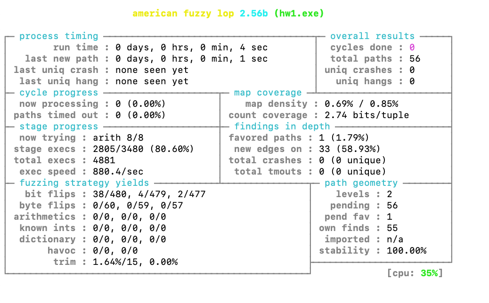
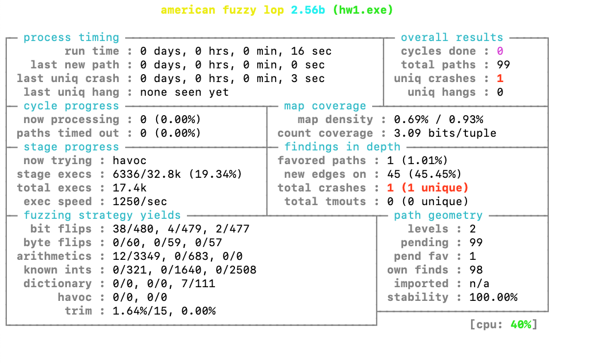

# Homework 1: Programming part

This directory contains an implementation of a REPL for a very simple arithmetic
language supporting natural numbers and addition. Here is a quick guide to the files.
- `syntax.ml` defines the AST type for expressions.
- `lexer.mll` and `parser.mly` define the lexer and parser for this little language,
  using the lexer-generator `ocamllex` and the parser-generator `menhir`.
- `hw1.ml` implements an interpreter for expressions, and a read-eval-print loop
  that continually parses an expression from standard input and prints its value.
- `dune` is a configuration file for the build system of the same name.
- `tests.input` and `tests.expect` contain an example input for the REPL and its
  expected output.

## Installing dependencies

- Install `opam`, following [its instructions](https://opam.ocaml.org/doc/Install.html)
  - Linux and macOS are supported directly.
  - On Windows, we recommend using WSL/Bash on Windows, or a VM. However,
    Problem 3 uses `afl`, which does not run on Windows. If you need help
    setting up a VM for this problem, get in touch.
- Initialize opam using `opam init` and follow any instructions it prints
  about editing shell configuration files. See the
  [usage page](https://opam.ocaml.org/doc/Usage.html) for more details.
- `opam switch install 4.10.0` to install the most recent version of OCaml.
- Ensure your environment is set up correctly so that `which ocamlc` prints a path
  containing your `.opam` directory and that `ocamlc -version` prints `4.10.0`.
- `opam install dune menhir ppx_deriving` to get all the dependencies we need.
- Run `dune runtest` in this directory. It should build the starter code and
  run the tests, printing absolutely nothing in the end.

## Getting acquainted with the starter code (0 points, no need to turn anything in)

Take a look at `tests.input`. Input to the starter code REPL consists of a sequence
of expressions, each terminated by a double semicolon. The expression itself can
span multiple lines. The REPL evaluates each expression and prints the results.
Now look at `tests.expected`, which contains the expected output from the REPL
starter code. Use `dune runtest` to automatically run the REPL on `tests.input`
and diff the results with `tests.expected`. To make sure things are working,
try editing `tests.input` to add a new test case, and ensure that `dune runtest`
reports an error. Then update `tests.expected` and observe that `dune runtest`
now succeeds (prints nothing).

Try the REPL on your own tests by running `dune exec ./hw1.exe` and then typing
some expressions (and double semicolons!) on standard input to see their values.

Now take a look at `hw1.ml`. The main loop is near the bottom of the file,
where `Parser.main` is called repeatedly to get an *optional* expression.
The parser returns `None` to indicate that the end of input has been reached.
Otherwise, if the parser returns `Some e`, then the value of `e` printed and
the loop continues.

Now look at `parser.mly`. The file has two parts. Above the `%%` are declarations
of tokens, their precedences and associativities, and the start symbol `main` and
the type of its semantic values. You can see that the grammar of `main` is either
the `EOF` token, or an expression followed by a double semicolon. The grammar of
expressions has one rule for each kind of AST node, plus an extra rule for
parentheses (which influence the tree structure, but are not explicitly represented
in the AST).

Each of the tokens declared in `parser.mly` is defined by a regular expression in
`lexer.mll`. The lexer also skips whitespace and keeps track of how many newlines
have been seen so far (useful for printing source locations on error messages).
Finally, if lexer encounters a character that does not match any of the regular
expressions, it raises the `Lexer.Error` exception with a message.

## Problem 1: Adding booleans

10 points: 8 for code and 2 for tests

Add support to the REPL for `true`, `false`, and `&&`. Demonstrate the new features
by adding at least one use of each new language construct to `tests.input` and
update `tests.expected` accordingly.

The previous paragraph might be enough for you to do the whole problem on your
own; feel free to try it without reading further! (In fact, you are encouraged
to make an attempt!) Because different people have different backgrounds, we
include fairly detailed instructions to help, especially with the parser. You do
not have to follow them if you don't want to, as long as you implement support
for `true`, `false`, and `&&` in the REPL. If you choose to work on your own,
once you are done, you can proceed directly to Problem 2 below.

Detailed instructions/hints for Problem 1:

- Start by adding a type to represent values in `syntax.ml`. Values in the starter
  code are always integers, but now they will be either integers or booleans. (Use
  a type with two constructors, one for ints and one for bools.) Be sure to declare
  your type `[@@deriving show]`.

- Change the `Literal` constructor in `expr` to take a `value` instead of an `int`.

- Add a constructor to `expr` to represent an AST node for the `&&` operator.

- In `parser.mly`, declare new tokens for boolean literals (true/false) and for
  the `&&` operator.

- In `lexer.mll`, add regular expressions to define the concrete syntax of each of
  the new tokens you added. Note that a multi-character string requires double-quotes.
  See the rule for `;;` for an example. If you try to use single-quotes instead
  you will get an error later while compiling the lexer:

      illegal character '.

- Back in `parser.mly` add rules to the grammar for `expr` that parse the new
  language features. Also, adjust the rule to parse integer literals to use
  the new value type. (Otherwise you will get type errors when compiling the parser.)

- In `hw1.ml`, temporarily comment out the `eval` function, and temporarily edit
  the main loop to print the AST itself rather than calling `eval` directly.
  Something like:

      | Some e ->
         Printf.printf "%s\n%!" (Syntax.show_expr e);
         loop ()

- Run `dune build` and fix any errors or typos. You should get one real error from
  `menhir` that looks like this:

      menhir parser.{ml,mli} (exit 1)
      Error: 2 states have shift/reduce conflicts.
      Warning: 3 shift/reduce conflicts were arbitrarily resolved.

  To get more information on this error, run `menhir` yourself, like this:

      menhir --strict --explain parser.mly

  This will produce several output files, including `parser.conflicts`. Open this
  file to see a description of the conflicts.

  This is caused by an ambiguity in the grammar on (ill-typed, but never mind)
  expressions such as `1 + 2 && 3`. The parser is not sure how such expressions
  should be parenthesized.

  We can resolve the conflict by adding a line analogous to `%left PLUS` in
  `parser.mly` but for the token `&&` (whatever you called it). Here `%left`
  means that the operator is left associative (there are also `%right` and
  `%nonassoc`). The relative order of the associativity declarations in
  the file is the parsing priority the operations, from lowest priority
  (loosest binding) to highest priority (tightest binding). See section 4.1.4
  of the [Menhir manual](http://gallium.inria.fr/~fpottier/menhir/manual.html).
  In this case, it does not matter which of `+` and `&&` have higher precedence,
  since in the current language, no well-typed program can use both in the same
  expression. So, you can put the lines in either order.

  We will be building several parsers over the course of the quarter, so you
  will need to gain a working knowledge of parser conflict resolution. It is a
  bit of a black art, so definitely ask questions if you are stuck. The
  [Menhir manual](http://gallium.inria.fr/~fpottier/menhir/manual.html) is quite
  good and worth reading, but in some places it does assume you are familiar
  with the theory of LR(1) parsing. Since we are *not* assuming you are familiar
  with this, definitely definitely ask questions :)

  The output files of our manual run of `menhir` will confuse `dune`. Remove them
  like this:

      rm parser.ml parser.mli

  (Be careful not to remove the `.mly` file, which looks very similar to `.mli`.)

- After fixing the parser conflict, `dune build` should succeed (print nothing).

  Now you can try `dune exec ./hw1.exe` and then type in some expressions containing
  booleans on standard input. (Don't forget the double semicolons!)

  Remember that we've temporarily edited `hw1.ml` to print the AST instead of
  evaluating it. In our solution, we got something like this:

      jrw$ echo "true && 0 + 3 && false;;" | dune exec ./hw1.exe
      (Syntax.And (
         (Syntax.And ((Syntax.Literal (Syntax.VBool true)),
            (Syntax.Add ((Syntax.Literal (Syntax.VInt 0)),
               (Syntax.Literal (Syntax.VInt 3))))
            )),
         (Syntax.Literal (Syntax.VBool false))))
      bye!

  Here we mix `&&` and `+` in one (ill-typed) program, just for fun. Your AST may
  be different from ours because of different choices in parsing priority, and
  because of minor differences in the design of the AST nodes and their names.
  None of these details matter, (and you will not be graded on them); but you
  should get something reasonable looking from your implementation at this point.

- Go back to `hw1.ml` and uncomment `eval`. Change its type annotation to return
  a value.

  You should now get an error for the `eval` case for `Syntax.Add`:

      File "hw1.ml", line 4, characters 27-34:
      4 |   | Syntax.Add (e1, e2) -> eval e1 + eval e2
                                     ^^^^^^^
      Error: This expression has type Syntax.value
             but an expression was expected of type int

  This error says that `eval` returns a value, but we're trying to use OCaml's
  built-in `+` operator on it. This won't do!

  Fix this using a method of your choosing. In the case where `eval` returns the
  wrong kind of value (eg, bool when you were expecting an int to add), throw an
  exception of your choosing. (Preferably, you should declare an exception with
  a name like "runtime error" or "evaluation error" or something along those
  lines, and include appropriate error messages describing exactly what went
  wrong.)

  Make sure that your `eval` returns a value for the `Add` case.

  Now add any remaining cases to `eval` to support the new language constructs.

- Undo the temporary edit to the main loop to restore the call to `eval`. Since
  `eval` now returns a value instead of just an int, you will need to call the
  `show_value` (or whatever you called your value type) function to convert it
  to a string.

  `dune build` should succeed (print nothing).

  `dune runtest` will fail, since we've changed the output format of the REPL.
  Inspect the diff it prints to make sure the numbers are the same, just with
  some extra stuff about values and ints. Once you are happy that the output
  looks correct, run `dune promote` to automatically update the expected output
  to the new format. Further runs of `dune runtest` should now succeed (print
  nothing).

- Add tests to `tests.input` to demonstrate each of the new features at least
  once. You can either add you expected outputs to `tests.expected`, or just
  directly run `dune runtest`, carefully inspect the diff to ensure the
  results make sense, and then run `dune promote` to update `tests.expected`
  automatically.

## Problem 2: Type checking

10 points: 8 for code and 2 for tests.

Add type checking to the REPL.

If the user enters an ill-typed expression, do *not* evaluate it, and instead
print an appropriate error message, before continuing the main loop. (In other
words, do not exit on type errors.) Also, extend the REPL to print the type of
each well-typed expression that the user enters.

Add at least one ill-typed expression to `tests.input` and ensure that the
REPL correctly reports a type error and can continue to further expressions.
Use `dune runtest` / `dune promote` to add the expected output to the
test suite.

More detailed instructions (but less detailed than Problem 1) are below.
Again, feel free to attempt this problem without reading further, and proceed to
Problem 3 when done.

- Add an OCaml type to `syntax.ml` that describes the syntax of types (int and bool).
  Note that you cannot call this type "type", since that is an OCaml keyword.
  Our solution calls it `ty` instead. Use `[@@deriving show]` to get a
  `show_ty` function.

- In `hw1.ml`, add a function `type_infer` that takes an expression and returns
  its type, if it is well typed, or throws an exception with an appropriate if
  it is not well typed. (Preferably, you should declare an exception with a name
  like "type error", and include appropriate error messages.)

- In the main loop, after parsing an expression, but before evaluating it,
  call `type_infer` to retrieve the expression's type. Assuming this succeeds,
  proceed to evaluate the expression, and then print both the value *and* the
  inferred type.

  Be careful to catch the exception thrown by `type_infer` in the right place.
  There is an existing `try/with` block in the file, but that is not the right
  place! You must catch this exception in the body of the loop, so that
  the loop can continue, skipping any ill-typed expressions.

- Test your type checker by providing a mix of well-typed and ill-typed
  expressions. Ensure that the REPL successfully reports errors and skips
  ill-typed expressions and proceeds to evaluate well-typed expressions.

  Add a few ill-typed expressions to `tests.input` and use `dune runtest`
  to ensure the output is reasonable. Then use `dune promote`.

# Problem 3: Fuzzing type safety

10 points: 5 for the crashing input and bugfix, and 5 for written explanations
in this file. Extra credit for the optional part is possible.

In class on Friday, we will prove that well-typed expressions never encounter
runtime errors. Let's see how well that holds up in practice by using
automatically searching for an input that cause our REPL to crash.

A fuzzer is a program that searches for inputs that cause another program to crash.
A widely used fuzzer is `afl`, which has nice support in OCaml.

For this problem, follow the detailed instructions below and be sure to answer
the written questions.

- Use `opam` to install the `+afl` variant of the OCaml compiler, which compiles
  code with special instrumentation for use by fuzzers.

      opam switch install 4.10.0+afl

  Since `opam` switches are completely isolated from each other, we need to
  reinstall all our dependencies.

      opam install dune menhir ppx_deriving

- Install `afl` itself. It does not run on Windows.

  On macOS, `brew install afl`. On Debian/Ubuntu, `apt install afl`.

- Rebuild the project with the new compiler:

      dune build

- Setup directories and test input and run `afl`:

      mkdir afl-seed-inputs
      mkdir afl-workspace
      cp tests.input afl-seed-inputs/
      afl-fuzz -i afl-seed-inputs -o afl-workspace ./_build/default/hw1.exe

- At this point, `afl` will take over the terminal window with a fancy UI that
  reports on its progress. It should look something like this:

  

  After a few seconds (~15 seconds on my machine) you should see it report its
  first discovered crashing input, which will look something like this:

  

  You can choose to let it keep running, or terminate it with Ctrl-C.

- Inspect the `afl-workspace/crashes` directory to see the crashing input(s).
  The inputs will have very strange names starting with `id:` and then a number
  with a lot of leading zeros, and then a bunch of other stuff. Make note
  of one of the filenames, and take a look at its contents.

  Then run the REPL on the input, like this:

      dune exe ./hw1.exec < afl-workspace/crashes/<YOUR FILENAME HERE>

  You should see that the REPL throws an exception. Make a copy of the crashing
  input and turn it in with your homework as a file named "crashes.in" in this
  directory.

- Debug this exception by looking at the exception message and by inspecting
  the input file. What is the root cause?

      Function `int_of_string` in lexer causes an exception. The root cause is the number represented by the string causes an integer overflow while converting it to an ocaml integer.

- Fix the bug. There is more than one way to do it. Pick the way that seems
  best to you. Describe your fix briefly here.

      Catch the exception. If there is an exception then return the value of `max_int`, otherwise use the value returned by `int_of_string`

- After fixing the bug, rebuild with `dune build` and re-run the fuzzer for
  a few minutes (or more, if you like). In our solution, we did not find any
  further bugs. If you do find some in yours, let us know!

- Introduce a bug into your type checker or evaluator such that there are some
  well-typed expressions that cause an exception to be thrown during evaluation.
  Rerun the fuzzer. Does it find it? Does it take shorter or longer to find than
  the first bug above? Why do you think this might be?

      I change the evaluation of `ADD e1 e2` to calculate `e1 / e2`. The minimal input to the interpreter that will throw an exception is `1 + 0`, and the exception is `division_by_zero`. The fuzzer catches the bug very quickly (only took around 5 seconds to find the first input that will cause the exception). I think this is reasonable, since `division_by_zero` is a very common bug a program might have and the fuzzer may try this common inputs first.

- (Extra credit) Try to optimize (pessimize?) the bug you introduce into your type
  checker so that it takes as long as possible for the fuzzer to find it, while
  still being a "high-level" logical bug that can be described on paper using
  the language of type systems and operational semantics. Can you find a bug
  that the fuzzer cannot detect?

      The "optimization" I made is: when evaluating `Syntax.Literal x`, instead of returning `x` directly, I changed the value of `x` to `x - 1145141919810`. This will restrict that only when the right-hand-side operand of the addition operator equals 1145141919810, the program crashes due to division-by-zero. This is very hard to find (since 1145141919810 is a magic number which is hard to touch only by generating inputs randomly without doing something like bounded model checking or symbolic evaluation). Running on my computer for 10 minutes, the fuzzer didn't find the expected input that will cause the program to crash. 

## Problem 4: Adding variables

20 points: 16 for code and 4 for tests

Add variables to the REPL.

For example, the following should be valid input

      x = 1 + 2;;
      y = x + x + 3;;
      y + 7;;

and should produce output something like

      x = 3 : int
      y = 9 : int
      16 : int

(It's fine if the printed format of types and values because you use the
auto-generated `show_` functions.)

Detailed instructions:

- In `syntax.ml`, introduce a new type for "variable bindings" like `x = 1 + 2`.
  A binding should consist of an optional variable name and an expression,
  so that it can also represent "raw" expressions that are entered into the
  REPL but not assigned to any variable.

  The exact details of the representation are up to you.

  Add a constructor to `expr` to represent variables. Variable names should
  be represented by strings.

- In `parser.mly`, declare new tokens for the equals sign and for variable names.
  The correct way to declare the variable name token is something like

      %token <string> FOO

  where you should replace `FOO` with whatever you want to name this token. This
  declares a token that carries a string (the name of the variable), similar
  to how the `INT` token in the starter code carries an int.

- In `lexer.mll`, add regular expressions for the new tokens. You may need to
  consult the relevant
  [section](https://caml.inria.fr/pub/docs/manual-ocaml/lexyacc.html#ss:ocamllex-regexp)
  of the manual about `ocamllex`'s syntax for regular expressions.

  For variable names, your regex should support *at least* upper- and lower-case
  letters. Feel free to allow more characters as well, if you want.

  Take care to order the regular expression for variable names correctly in the
  file. Consult the
  [section](https://caml.inria.fr/pub/docs/manual-ocaml/lexyacc.html#ss:ocamllex-entry-points)
  of the manual that discusses how the lexer works when more than one rule matches.

- Back in `parser.mly`, change the type of `main`'s semantic value to be an
  optional variable binding. Add a new production for `main` that can parse
  bindings to variables, as in `x = 1 + 2`. Also update the old productions
  to make sure they also now return (optional) bindings, not expressions.

  Extend the grammar for `expr` to parse references to variable names using
  the new constructor you added previously to the `expr` type in `syntax.ml`.

- At this point, `dune build` should only report errors in `hw1.ml`, not in
  the parser or lexer. Fix any lingering parser or lexer errors now.

- In `hw1.ml`, there will be several errors in the evaluator and type checker
  about missing cases, but ignore these at first, and go down to the main
  loop. There will be an error here due to the fact that the parser now returns
  a binding, not an expression. The REPL will now need to maintain some state
  across iterations of the main loop to keep track of the types and values
  of the various variables in use.

  We suggest introducing two types, for the "static environment" and "dynamic
  environment" of the REPL. The static environment should map variable names
  (strings) to their types. The dynamic environment should map variable names
  to their values. The details of the representation are up to you.

  Change the `loop` function to remove its `unit` argument, and instead take a
  static environment and a dynamic environment. Initialize these correctly in
  the top-level call to loop, so that when the loop begins its first iteration,
  the environments are empty (the details depend on your choice of representation).

  When `loop` calls the parser, change the variable name of the result from `e`
  to `b`, to remind you that it is a binding, not an expression. The question
  is now: how do we type check a binding, and how do we evaluate a binding?

- Rename your `type_infer` function into `type_infer_expr`, and introduce a new
  function `type_infer_binding` that takes the static environment and a binding
  and returns a pair of the type of the expression and a static environment.
  The new environment should be extended with a new mapping from the name in the
  binding to the type of the expression.

  Pass the static environment from `type_infer_binding` to `type_infer_expr`.
  Extend `type_infer_expr` with a case for looking up the type of a variable
  in the environment.

  Update the call from `loop` to call `type_infer_binding` and record the
  type and the new static environment.

  Be careful to preserve the property that the REPL catches type errors,
  and in that case skips evaluation and continues to the next loop iteration.

- Rename your `eval` function into `eval_expr` and introduce a new function
  `eval_binding` that takes the dynamic environment and a binding, and
  returns a pair of the value of the expression and a dynamic environment.
  The new environment should be extended with a new mapping from the name in
  the binding to the value of the expression.

  Pass the dynamic environment from `eval_binding` to `eval_expr`. Extend
  `eval_expr` with a case for looking up the value of a variable in the
  environment.

  Update the call from `loop` to call `eval_binding` and record the value
  and the new dynamic environment.

- Update `loop` to print the variable name being bound (if any) in addition
  to the value and type of the expression in the binding.

- Write tests for the new language features in `tests.input`. Be sure to
  include at least one test that checks that the REPL can continue past
  an ill-typed binding to evaluate subsequent bindings. Use `dune runtest`
  and `dune promote` to update the expected outputs.

## Problem 5: Ideas for extra credit

Here are a few ideas for good REPL extensions that make it a little more "real".

- Track source location information (line number and column number) on expressions,
  and use them to give more precise error locations in error messages.
- Read about `menhir`'s support for error messages on parse errors. Do something
  to improve our parse errors. (For example, you could try to compute the set
  of tokens that are permissible in the current parsing state and report it to
  the user.)
- Write an editor mode for our little expression language that uses the REPL
  to syntax check the file in the background.
- Add a command line option to the REPL to allow taking input directly from a file.
  Use this filename in error messages.
